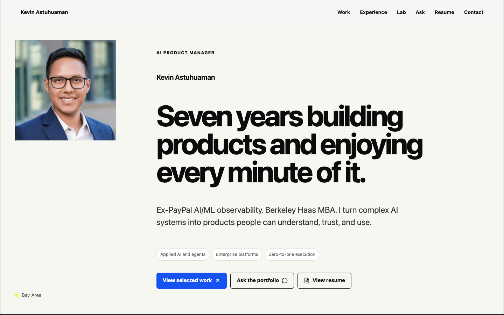
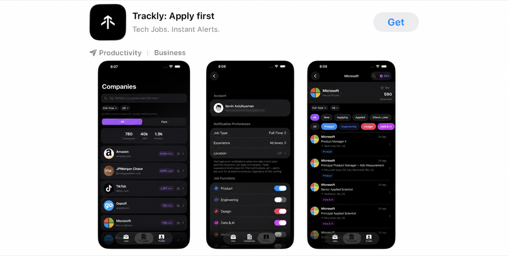

# Hi, I'm Kevin 👋

📍 San Francisco, CA | 🎓 Haas MBA '26 | 🔧 Ex-PayPal AI/ML Observability

  
  
  
  
  
  
  
  
  
  
  
  
  

A product guy who loves building (and a big Bad Bunny fan). I deeply believe comfort is the most expensive thing you'll ever buy.

> "Simplicity is the ultimate sophistication." - Leonardo da Vinci

[Portfolio](https://portfolio.kevinastuhuaman.com) | [Ask my portfolio](https://portfolio.kevinastuhuaman.com/ask/) | [PayPal case](https://portfolio.kevinastuhuaman.com/projects/paypal-ai-observability/) | [Resume](https://portfolio.kevinastuhuaman.com/resume/) | [LinkedIn](https://www.linkedin.com/in/kevinastuhuaman/)

  

## Building Trackly

- 📱 [Trackly on the App Store](https://apps.apple.com/us/app/trackly-apply-first/id6758267565) - real-time tech job openings before they reach job boards.
- 🔗 [usetrackly.app](https://usetrackly.app) - the live web product that monitors 3,800+ active company career sites with 170,800+ active jobs.
- ⌨️ [trackly-cli](https://github.com/trackly-app/trackly-cli) - open-source CLI and MCP server for bringing Trackly into agent workflows.

  

## Current projects

### Case studies

- 💳 [PayPal Checkout](https://portfolio.kevinastuhuaman.com/projects/paypal-ai-observability/) - agentic observability prototype and POC for faster investigations.
- 🏦 [BCP / Credicorp](https://portfolio.kevinastuhuaman.com/projects/smb-fintech-bcp-credicorp/) - six years building products for small businesses in a regulated bank.
- 🎓 [Berkeley × MoBagel](https://portfolio.kevinastuhuaman.com/projects/berkeley-mobagel-ai-gtm/) - discovery, Figma, roadmap, pricing, and U.S. go-to-market for an AI platform.
- 🤖 [Ask my portfolio](https://portfolio.kevinastuhuaman.com/ask/) - a grounded chat and voice assistant for exploring my work.

### Agents, controls, and evals

- 🔍 [ai-investigation-workbench](https://github.com/kevinastuhuaman/ai-investigation-workbench) - turn scattered signals into an investigation a person can review.
- 🧭 [human-in-the-loop-patterns](https://github.com/kevinastuhuaman/human-in-the-loop-patterns) - choose when AI should undo, confirm, ask, or hand off.
- 🧱 [agent-workflow-canvas](https://github.com/kevinastuhuaman/agent-workflow-canvas) - map tools, approvals, failures, and recovery before writing code.
- 🧪 [evals-control-room](https://github.com/kevinastuhuaman/evals-control-room) - compare models, inspect errors, and decide what ships.

### Interfaces and motion

- 🧰 [ai-product-builder-stack](https://github.com/kevinastuhuaman/ai-product-builder-stack) - 65 tools and patterns mapped to real product work.
- 🖥️ [enterprise-ai-interface-kit](https://github.com/kevinastuhuaman/enterprise-ai-interface-kit) - seven patterns for AI products people can actually operate.
- 🎬 [ai-product-motion-studies](https://github.com/kevinastuhuaman/ai-product-motion-studies) - motion that explains state, failure, and recovery.

### Tools and experiments

- ⌨️ [trackly-cli](https://github.com/trackly-app/trackly-cli) - Trackly from the terminal, plus an MCP server for AI agents.
- 📈 [umami-mcp-server](https://github.com/kevinastuhuaman/umami-mcp-server) - ask questions about product analytics through MCP.
- 🛡️ [marketplace-refund-policy-kit](https://github.com/kevinastuhuaman/marketplace-refund-policy-kit) - simulate a refund policy before real customers feel it.
- 🎞️ [trackly-cli-video](https://github.com/trackly-app/trackly-cli-video) - a launch video built in React and Remotion.

---

## What I'm doing

- **Building Trackly** - shipping across web, iOS, macOS, CLI, MCP, chat, and voice.
- **Finishing my Haas MBA** - learning from people who see products very differently than I do.
- **Building in public** - turning product questions into demos you can click, test, and challenge.

## By the numbers

> 7 years building products · 3,800+ active company career sites · 170,800+ active jobs · 40 ATS and source types · 65 AI tools and patterns · 100,000+ small businesses reached

## GitHub activity

<picture>
  <source media="(prefers-color-scheme: dark)" srcset="https://ghchart.rshah.org/30a14e/kevinastuhuaman" />
  
</picture>

---

## Connect

  
  
  
  
  
  

## Recognition

- Co-organized Berkeley Haas' first AI & Tech Summit.
- Slusser Scholarship, Ida K. Rigby Scholarship, I-House Scholarship recipient.
- VP, Haas Tech Club + VP, Product Management Club at UC Berkeley Haas.
- Expanded loan access to 100,000+ small businesses at Peru's largest bank (NYSE: BAP).
- Co-founded Metta Uno, an EdTech platform for learning SQL and Python.

## Media

- 🎓 [PUCP Engineering Faculty feature](https://facultad-ciencias-ingenieria.pucp.edu.pe/2024/10/07/kevin-astuhuaman-egresado-de-ingenieria-industrial-admitido-a-maestria-en-berkeley/) - interview on my Berkeley admission.
- 📰 [Diario Gestion](https://gestion.pe/tu-dinero/finanzas-personales/prepagos-de-creditos-en-que-momento-hacerlo-para-ahorrar-mas-en-intereses-noticia/) - featured in Peru's top economics newspaper.
- 🏦 [BCP SME platform launch](https://youtu.be/w_49sTlM1DA?si=NqwLbs-kBTUmpfpL) - product launch video with 730K+ views.
- 🐻 [Berkeley Haas admits dinner](https://newsroom.haas.berkeley.edu/issue/spring-2024/worldwide-events-spring-2024/) - Haas newsroom feature.
- 🎙️ [Beyond the Backlog](https://podcasts.apple.com/za/podcast/beyond-the-backlog/id1812138539) - co-host of Berkeley's first PM podcast.

## Random facts

- 💃 [Salsa dancer](https://ihberkeley.com/2024/10/18/unity-in-motion-bridging-cultures-through-dance-at-international-house/) - bridged cultures through dance at UC Berkeley's International House.
- 📺 [YouTuber](https://www.youtube.com/@kevinastuhuaman) - 15K+ subscribers; my personal finance channel was cited by Peru's largest economics newspaper.
- 🤖 [Straude](https://straude.com/u/kevinastuhuaman) - $100K+ in tracked token spend; [Garry Tan](https://straude.com/u/garrytan) follows me.

---

Some work is open source. Some is a public-safe reconstruction. Customer data, private source, and production credentials stay private.
